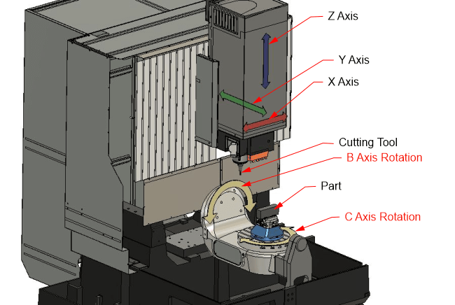

# ⚙️🤖 CNC Monitor: Data-Driven Monitoring of CNC Milling Machines 🖥️📊🛠️

**CNC Monitor** is a framework designed to support **data-driven monitoring of CNC milling machines** using the Bosch benchmark dataset from *“Smart Data Collection System for Brownfield CNC Milling Machines”*. The goal is to enable predictive maintenance and anomaly detection, helping operators and engineers identify deviations and potential failures in real-time with quantum computing.

The framework combines advanced techniques in:  
- **Signal Preprocessing:** Filtering and smoothing multivariate machine signals (vibration, spindle, feed axes).  
- **Windowing & Feature Extraction:** Segmenting time series into informative windows and computing metrics like variance, RMS, or spectral features.  
- **Anomaly Detection:** Using machine learning models trained on normal operational data.  
- **Quantum Computing:** Leveraging Quantum Temporal Kernels (QTK) to embed multivariate time-series data into a quantum feature space, capturing complex temporal correlations and enhancing anomaly detection capabilities beyond classical method
<div align="center">
  
  
</div>

---

## 🚀 Pipeline Overview

### 📦 Data Preprocessing and Windowing
- Load raw sensor time series (vibration along X, Y, Z axes).  
- Apply **high-pass filtering** to remove low-frequency noise (e.g., <75 Hz).  
- Split each time series into **fixed-size windows** (e.g., 4096 samples).  
- Select the **most informative windows** using combined variance or other metrics.  

Outputs both **raw** and **filtered/segmented** windows ready for modeling.

### ⚙️ Feature Representation
- Optionally, apply **convolutional layers** or other feature extraction techniques to enrich the windows while preserving temporal structure.  
- Prepare features for **Quantum Temporal Kernels (QTK)** or classical ML models.

### 🧠 Anomaly Detection / Predictive Modeling
1. **Data splitting:**  
   - Training: normal operation windows.  
   - Test: other normal operation windows or unseen time periods.  
   - Anomalous: manually or automatically labeled anomalies (if available).  

2. **Modeling:**  
   - Classical or quantum kernel methods, LSTM autoencoders, or hybrid approaches.  
   - Compute metrics such as RMSE, Pearson/Spearman correlations, reconstruction error.  

3. **Evaluation:**  
   - Compare predictions to normal operation data.  
   - Identify anomalies based on deviation from learned normal behavior.  

---

## 📁 Repository Structure

```bash
.
├── preprocessing/
│   └── dataset_preprocessing.ipynb
├── requirements.txt
└── README.md

```

# 🛠️ How to Run the Pipeline

# 1. Install dependencies
pip install -r requirements.txt
