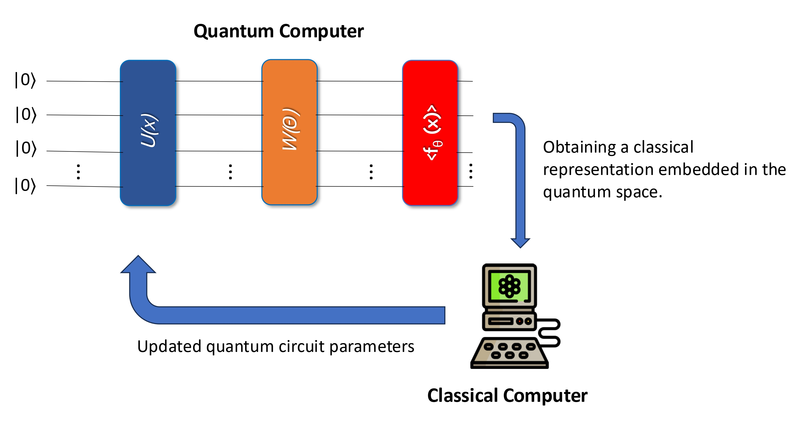

## 🏭🚨🛠️🧪🚰 Adaptive Quantum Temporal Kernel Framework (AQTKF) for Anomaly Detection in Multidomain Industrial Scenarios 🖥️📊🧠🤖⚛️

**Adaptive Quantum Temporal Kernel Framework (AQTKF)** is a general-purpose framework for **kernel-based anomaly detection in heterogeneous industrial domains**.

The framework is designed to operate across **different industrial systems and sensing modalities**, and it is validated on three representative datasets:

* **CNC Milling Machines**
  (*Smart Data Collection System for Brownfield CNC Milling Machines*, Bosch dataset)
* **SKAB**
  (*Skoltech Anomaly Detection Benchmark*) for multivariate industrial time-series anomaly detection
* **H2-Net**
  A custom simulation-based dataset for **anomaly detection in hydrogen transport and hydrogen-blend networks**

The goal of AQTKF is to enable **robust anomaly detection** in the presence of noise, complex temporal dependencies, and limited labeled data, while exploring the potential of **quantum kernel-based representations** for industrial time-series modeling.

---

## Framework Overview

AQTKF is composed of the following elements:

* **Signal Preprocessing (Optional and Dataset-Dependent)**
  Preprocessing operations are applied **only when meaningful for the specific domain**.
  In particular, smoothing via **moving average** is applied to the **H2-Net** dataset, while **raw signals are used for CNC and SKAB** without additional filtering.

* **Temporal Windowing**
  Segmentation of multivariate time series into fixed-length temporal windows.

* **Kernel-Based Modeling**
  All learning and inference stages rely exclusively on kernel methods.

* **Quantum Computing**
  Use of **Quantum Temporal Kernels (QTK)** to embed multivariate temporal windows into a quantum feature space, explicitly encoding temporal dynamics within a parameterized Hamiltonian.

<p align="center">
  
</p>

---

## Pipeline

### Data Preprocessing and Windowing

* Load raw multivariate sensor time series
  (e.g., vibration, pressure, flow, control signals)
* **Optionally apply signal preprocessing**, limited to **moving-average smoothing** in the case of the H2-Net dataset
* Segment the signals into fixed-size temporal windows
* Select informative windows using variance-based or energy-based criteria

This stage is **configurable and dataset-dependent**, while preserving a common structure across CNC, SKAB, and H2-Net.

---

### Feature Representation and Kernels

The data representation in AQTKF is **entirely kernel-based**.
No neural networks or deep learning models are used.

The framework compares:

* **Classical kernels** applied to multivariate temporal windows
* **Hardware-efficient quantum kernels**, based on a parameterized ansatz **without explicit temporal modeling**
* **Quantum Temporal Kernels (QTK)**, where temporal information is encoded directly in a **learnable Hamiltonian**

For the QTK, the Hamiltonian parameters are:

* fixed (non-optimized baseline), or
* **optimized via evolutionary algorithms**, including genetic and multi-objective approaches

This design allows for a controlled evaluation of:

* the impact of explicit temporal encoding,
* the effect of evolutionary optimization,
* the difference between static and temporal quantum embeddings.

---

### Anomaly Detection Strategy

Anomaly detection is performed using a **One-Class classification algorithm**, to which only the kernel function is provided.

The learning procedure is structured in two phases:

1. **Kernel Parameter Learning (Weakly Supervised)**

   * A reduced training and test set is used
   * A limited number of anomalous samples are included to enable **weak supervision**
   * Evolutionary algorithms are employed to optimize the parameters of the temporal Hamiltonian in the QTK

2. **Evaluation Phase**

   * The learned kernel is applied to **larger training and test sets**
   * The One-Class model remains fixed, and only the kernel varies

This setup ensures that performance differences are **entirely attributable to the kernel design**, enabling a fair comparison between classical and quantum kernels.

---

## Repository Structure

```bash
.
├── preprocessing/
│   └── dataset_preprocessing.ipynb
├── src/
│   ├── skab_code/
│   │   ├── main.py
│   │   ├── other_kernels.py
│   │   ├── preprocessing.py
│   │   └── qtk.py
│   ├── hydrogen_code/
│   │   ├── main_hydro.py
│   │   └── processing_hydrogen.py
│   └── cnc_code/
│       ├── bworth_filter.py
│       ├── main.py
│       ├── other_kernels.py
│       ├── preprocessing_data.py
│       └── qtk.py
├── README.md
├── circuit_ansatz.jpg
├── cnc_milling.jpg
└── requirements.txt
```

---

## How to Run

```bash
pip install -r requirements.txt
```
